= Gaze Controlled Computer
:idprefix:
:idseparator: -
:sectanchors:
:sectlinks:
:sectnumlevels: 6
:sectnums:
:toc: macro
:toclevels: 6
:toc-title: Table of Contents
:video:
:experimental:

toc::[]

Ivan Systerov, Jake Apted, Ken Guo, Christopher Shim

Computer/Electrical Engineering Capstone Design Project

Toronto Metropolitan University, 2023

https://www.youtube.com/watch?v=XmJs5W_n69U

image::https://img.youtube.com/vi/XmJs5W_n69U/hqdefault.jpg[link="https://www.youtube.com/watch?v=XmJs5W_n69U"]

== Certification of Authorship

We, Ivan Systerov, Jake Apted, Ken Guo, and Christopher Shim, certify
that the work presented in this report is our own, and any ideas or
assistance received has been properly cited and acknowledged.

[[abstract]]
== Abstract

This project aims to help physically disabled people to operate a
computer. A portable hands-free computing solution which will allow
these users to control the mouse and (virtual) keyboard of a computer
through gaze only will be built. The user’s gaze will be captured
through a webcam and mapped onto the screen so that the user can
navigate the cursor by looking at different areas of the screen. The
webcam will be mounted on a movable arm which can be clamped to the side
of a desk and it can be adjusted to rotate and tilt to fit the user’s
needs. The software should be able to calibrate the user’s gaze by
asking the user to look at certain points on their screen. After the
user’s gaze is calibrated, they will be able to move the cursor. The
user will be able to left-click by closing their eyes for a short amount
of time. To provide more mouse actions, a user can open their mouth and
an accessibility menu will appear which shows different actions such as
open browser, open file explorer, open email, or open keyboard. Then the
user can click on one of these and continue. The user will also be able
to type on a virtual keyboard using their eyes and blinking. Testing was
done to compare the accuracy of the tracking in different lighting
conditions. The results showed that the accuracy in poor lighting and
optimal lighting was 93.55% and 97.50% respectively. Thus, having
sufficient lighting is required for the tracking to be accurate.

This project was successfully completed using Python, Dlib, and OpenCV
and an external webcam. The application was able to detect the user’s
eyes and track their movements. It maps their eye coordinates to the
screen to a usable accuracy and the user interface provides additional
functionality to the user.
[[introduction-background]]
== Introduction & Background

There are many people who have a physical disability which inhibits them
from interacting normally with essential devices such as a computer.
This project aims to build a portable hands-free computing solution
which will allow these users to control the mouse and keyboard of a
computer through gaze only. The user’s gaze was captured through a
webcam and mapped onto the screen so that the user can navigate the
cursor by looking at different areas of the screen. A webcam was used
and was mounted on a movable arm which was clamped to the side of a
desk. The webcam was adjusted to fit the user’s needs. With the webcam
in place, the software calibrated the user’s gaze by asking the user to
look at certain points on their screen.

After the user’s gaze is calibrated, they can begin moving the cursor.
The user was able to left-click by closing their eyes. To provide more
mouse actions, a user can open their mouth and an accessibility menu
will appear which shows different actions such as open browser, open
file explorer, open email, or open keyboard. Then the user can click on
one of these and continue. The user can also type on a virtual keyboard
using their eyes and blinking. Combining each of these features, the
program allows the user to comprehensively control a personal computer
system using only their gaze and facial gestures.
[[objectives]]
== Objectives

The objective is to build a hands-free computing solution which will
allow users to control the mouse and (virtual) keyboard of a computer
through gaze only.

[arabic]
. {blank}
+
____
The user’s gaze will be captured through a webcam and mapped onto the
screen so that the user can navigate the cursor by looking at different
areas of the screen.
____
[loweralpha]
.. {blank}
+
____
Create tracking component to be able to get eye coordinates from video
stream
____
. {blank}
+
____
Software should be able to calibrate the user’s gaze by asking the user
to look at certain points on their screen.
____
[loweralpha]
.. {blank}
+
____
Create calibration component to allow the user to calibrate the initial
conditions
____
. {blank}
+
____
After calibration, the user can begin moving the cursor with their eyes.
____
. {blank}
+
____
Enable left-click by closing their eyes for a short amount of time
____
. {blank}
+
____
Enable accessibility menu by opening mouth which shows different actions
such as open browser, show desktop, open file explorer, and open
keyboard.
____
[loweralpha]
.. {blank}
+
____
Create GUI component to allow different actions
____
. {blank}
+
____
Enable the user to be able to type on a virtual keyboard using their
eyes.
____
[loweralpha]
.. {blank}
+
____
Create keyboard component that will allow the user to pull up a virtual
keyboard
____
[[theory-and-design]]
== 4 : Theory and Design 

This chapter covers the theory and design choices made to develop the
gaze controlled computer. The sections are described in the order in
which the flow of the program is executed. It begins with details about
how the webcam frames are processed and concludes with user navigation
functionality.
[[frame-preprocessing]]
=== Frame Preprocessing

The process begins by gathering a video stream from the camera and
extracting individual frames from it (many frames are processed per
second, but only a single frame is processed at a time. This frame is
converted from its regular RGB colour space into greyscale colour space,
and is finally passed through a Gaussian filter to smooth the image
before any further processing is performed.
[[eye-tracking]]
=== Eye Tracking

To enable tracking of the eyes, Dlib and OpenCV were utilized. OpenCV
was used to process the video stream and the frames which were utilized
by Dlib. Dlib uses Histogram of Oriented Gradients (HOG) along with a
Support Vector Machine (SVM). HOG uses the gradient orientation of the
localized regions of an image and generates a histogram for each region
[1]. The purpose of using this is to extract the features from an image
and also to condense the information in an image into fewer values. HOG
first calculates the magnitude and angle of the gradient and then
generates a histogram based on the angles [2]. An SVM is a supervised
learning model that finds a hyperplane that separates data points into
different classes. An example of this is shown in Figure 4.2.2. The
hyperplane is chosen in a way such that the margin between classes is as
wide as possible [2]. Combining the result of the HOG with a SVM helps
to identify objects within the frame. Dlib is able to mark 68 facial
landmarks using HOG and SVM from frames as shown in Figure 4.2.3 [4].
For eye tracking, the points we mainly focused on are the 6 points
around each eye seen in Figure 4.2.4. After getting the 6 points, we
calculated the center of each eye and took the midpoint of both centers
to get an estimated gaze position. This gaze position is used to map eye
movements as cursor movement on the screen.

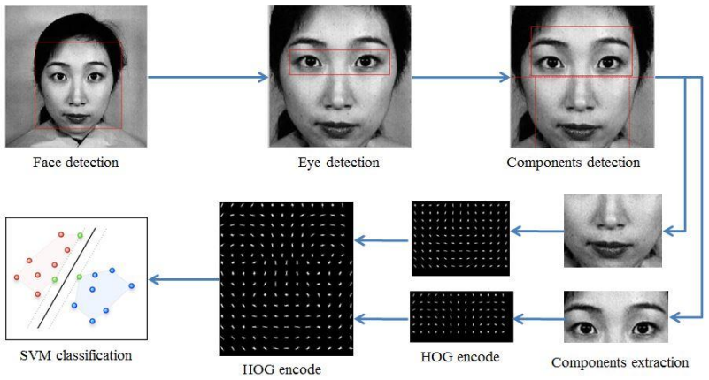

*Figure 4.2.1*: Example of Histogram of Oriented Gradients (HOG)
combined with SVM that detects features from an image.

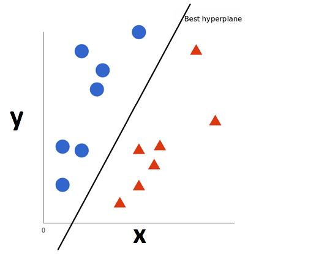

*Figure 4.2.2*: Example of Support Vector Machine (SVM) classification
of different objects.

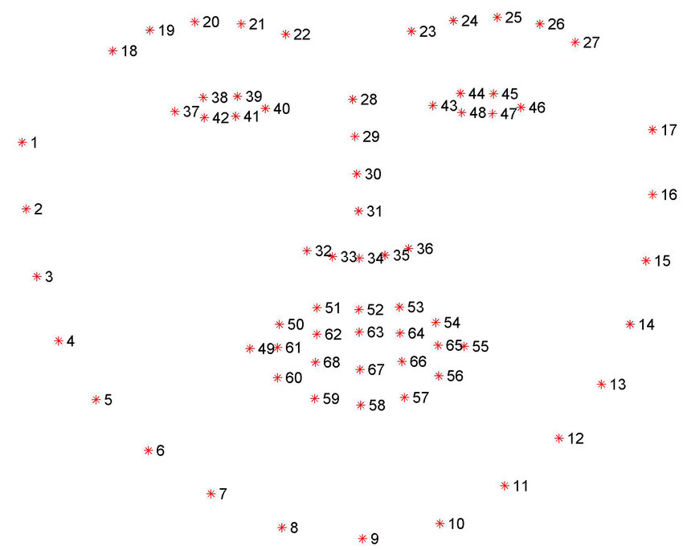

*Figure 4.2.3*: The 68 facial landmarks around the face

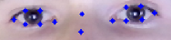
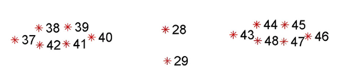 +
*Figure 4.2.4*: The facial landmarks defining the eyes
[[position-mapping]]
=== Position Mapping

The direction in which the eyes are facing is determined by comparing
the x and y coordinates of the key points to the center of the frame,
represented by "w_1/2" and "h_1/2," respectively. If the x coordinate of
the keypoint is greater than the center of the frame, the eyes are
considered to be facing right, and the code uses the library PyAutoGUI
to move the cursor 25 pixels to the left. On the other hand, if the x
coordinate is less than the center of the frame, the eyes are deemed to
be facing left and the cursor is moved 25 pixels to the right. The same
approach is applied to the y coordinate to determine if the eyes face up
or down, and the cursor is moved accordingly.
[[blink-detection]]
=== Blink Detection

To emulate mouse clicks and other functions apart from moving the mouse
we need to look at blink detection. We take 6 points around the contour
of the eye, and using the formula shown in equation (1), we can detect
the eye-aspect ratio (EAR) [3]. This is useful because EAR values will
rapidly fluctuate with the opening and closing of the eyes. We can
capture these fluctuations and create a range for where it will be
certain that the eye is either closed or open.Check the position of a
set of keypoints, such as the position of eyes in a video frame. The
process of detecting facial landmarks involves using dlib's pre-trained
model, "shape_predictor_68_face_landmarks.dat". The left and right eye
regions are extracted using variables "lStart" and "lEnd" and "rStart"
and "rEnd" respectively. The "ear_detector" function is used to
calculate the Eye Aspect Ratio (EAR) for both eyes in an input image. If
the calculated EAR falls below a certain threshold value,
EYE_BLINK_CONSTANT, it is deemed as a blink. If the user holds the blink
for a certain amount of frames we determine the type of click whether
right or left click.

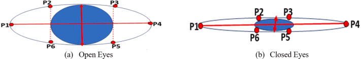

*Figure 4.4.1*: Showing the ratios of the points to determine blinking.

latexmath:[$EAR\  = \ \frac{\left| \left| p_{2} + p_{6} \right| \right|\  + \ \left| \left| p_{3} + p_{5} \right| \right|}{2\left| \left| p_{1} + p_{5} \right| \right|}$]
(1)

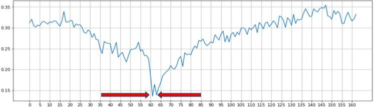

*Figure 4.4.2*: Shows a timeline of the EAR values to see when the blink
happened.
[[mouth-detection]]
=== Mouth Detection

A user can open and close their mouth to trigger the pop-up GUI, which
presents them with multiple different actions that can be performed such
as opening the virtual keyboard, or opening a web browser. The mouth
detection functions in a very similar way to the blink detection
mentioned previously, using landmark points from the Dlib trained shape
predictor model [4] to detect whether the user has opened or closed
their mouth. This is done by comparing the landmarks that define the
mouth's upper and lower lips, and calculating if they are lower than a
specified threshold (closed) or greater than the threshold (open). The
amount of time the mouth is open is once again compared to a
configurable threshold value, which will then notify the program that
the user has opened their mouth.

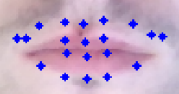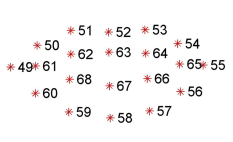

*Figure 4.5.1*: The facial landmarks defining the mouth
[[user-interface]]
=== User Interface

There are two menu user interfaces that the user can access. They are
the main menu and the accessibility menu. The main menu is the first UI
to be shown where the user can start tracking, start calibration or exit
the program. The accessibility menu can be brought up by the user when
they open their mouth. It has four directions that perform four
different actions respectively. The actions are open web browser, open
file explorer, open email, and open keyboard. The user can use this menu
to easily navigate their computer.

image:./images/media/image5.png[./images/media/image5,width=179,height=237]

*Figure 4.6.1*: Program Main Menu

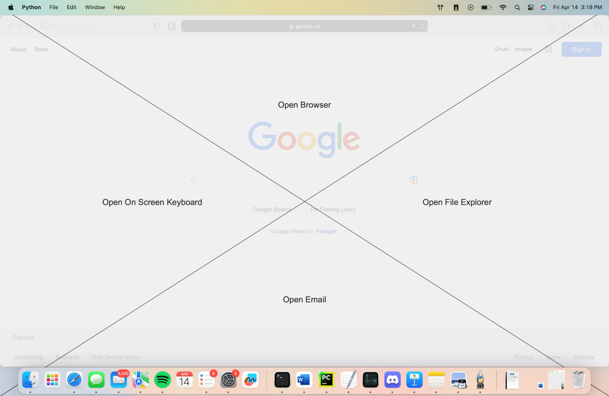

*Figure 4.6.2*: Screenshot of the accessibility GUI.
[[multithreading]]
=== Multithreading

Having the user interface and eye tracking processes running at the same
time is not possible without multithreading. The video stream runs in a
constant loop grabbing frames from the camera, while the user interface
runs in its own loop to detect any user inputs. This means that if run
on a single thread, the first one in the sequence will run without
letting the other process run. By multithreading them we are able to run
them simultaneously allowing the application to show the user interface
along with tracking eyes. Multithreading is achieved in our application
through the use of the Python thread class. Whenever the GUI needs to be
accessed a new thread is created to run the GUI process. When the user
is done with the GUI the thread will be killed.

Overall, the development of a gaze-controlled computer using webcam
frames, Dlib facial landmarks, blink detection, and mouth detection
presents an innovative approach to improving accessibility and usability
for users with physical disabilities. The advanced algorithms and
techniques used in the system allow for precise eye tracking, cursor
mapping, and gesture detection, which enables users to control their
computer through natural eye and mouth movements. Additionally, the
incorporation of a user-friendly accessibility menu with shortcuts and
the efficient multithreading of the graphical user interface enhance the
overall usability and accessibility of the system.
[[alternative-designs]]
== Alternative Designs

The original design plan was to process the webcam capture frames using
Canny Edge Detection and Circular Hough Transform to detect the user’s
eyes. This approach was tested and the results showed that only perfect
circles could be detected. As a result, this approach was only accurate
if the user was looking directly at the camera. This was unfavourable
because we needed to track the user’s eyes in all directions.

The second design plan was to use Haar cascades and blob detection to
isolate and track the movements of the eyes. This proved to be better
than the first approach as it could track the eyes in all directions.
However, this was removed in favour of Dlib since Dlib was deemed more
accurate and consistent than Haar cascades and blob detection in our
tests. Using Dlib allowed us to more accurately calculate the gaze of
the user since there were more landmark points to work with compared to
one blob detection keypoint.
[[canny-edge-detection-and-hough-transform]]
=== Canny Edge Detection and Hough Transform

Canny edge detection is a frame pre-processing procedure, which takes an
image as an input and outputs an image in grayscale. The grayscale image
is all black, other than where the edge of an object exists. This was
very useful when implementing the iris tracking algorithm, since the eye
and the iris could be much more easily distinguished after performing
edge detection [5].

The Hough transform was another process that was implemented early in
project development. Hough transform is able to detect specific shapes
within an image by converting it into the Hough domain and searching for
a specified pattern. This was used to detect the circular iris, but had
performance issues due to the circle needing to be complete with no
breaks, as well as the circle needing to be perpendicular to the camera
lens to be detected. This method of tracking meant that whenever a user
would turn their head or look too far in one direction, their iris shape
would warp into an oval and could not be tracked. This method was later
abandoned due to this issue.

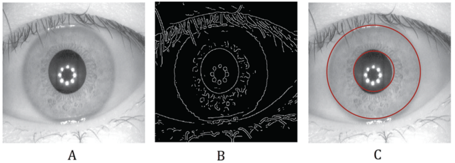

*Figure 5.1.1*: (A) grayscale input image, (B) Canny edge detection, (C)
Hough Transform

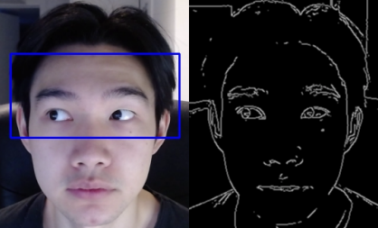

*Figure 5.1.1*: Example of absent detection of the eyes when looking far
right
[[blob-detection]]
=== Blob Detection

A blob is a group of pixels in an image which form a shape where the
pixels in the area share the same properties. The goal of using blob
detection is to accurately separate the iris from the sclera. This was
done by first applying grayscale and blur to the input which helped with
limiting the values which each pixel differs by and to eliminate noise.
A built-in blob detector from the OpenCV library is then used to run the
algorithm and identify the blobs in the input. The movement of the
user’s gaze was then mapped using the center coordinates of the detected
iris. After these steps were done and we had a stream of data processing
the position of the user's iris’, a location averaging function was
applied to a number of similar frames. This took the average location of
the user's iris’ to provide more stable and reliable tracking.

The issue we encountered when solely using blob detection was that there
were many instances that false blobs were detected in frames. An example
of this can be seen in Figure 5.2.1 (b). The solution we used to prevent
this was to restrict the region of detection using Haar cascade
classifiers.

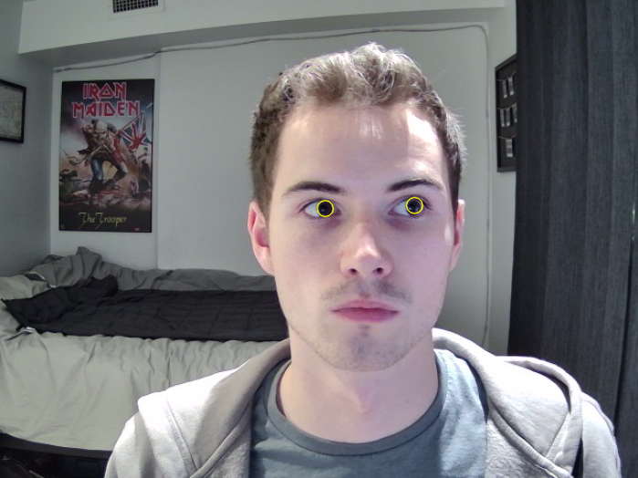

(a)

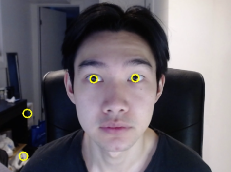

(b)

*Figure 5.2.1*: Eye tracking using blob detection. (a) Example of
detecting a user’s eyes when looking to the side. (b) Example of false
detections of blobs in the background.
[[haar-cascades]]
=== Haar Cascades

Haar cascades are machine learning algorithms made for object detection
in images and video. They are fed large sets of positive and negative
data and compute features through a cascading window on the inputs [6].
These features are specific to the object which the algorithm is trained
to detect.

Two pre-trained Haar cascade classifiers for the face and eyes were to
be used to better restrict the iris detection frame from the webcam
input feed. This reduced any false detections that were occurring during
initial testing. This also helped with computational load and response
time because the area which the blob detection is done on is smaller.

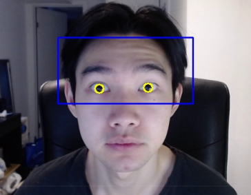

*Figure 5.3.1*: Combining blob detection and Haar cascades to restrict
detection area.

The issue with using the combination of Haar cascades and blob detection
was that the gaze of the user could not accurately be calculated based
on the keypoint centers of the detected blobs. When calculating the
difference in pixel changes while looking in different directions, the
result was too small to accurately map to the cursor and the resulting
cursor movement was very inaccurate. Thus, we decided to change the
tracking to use Dlib facial landmarks.

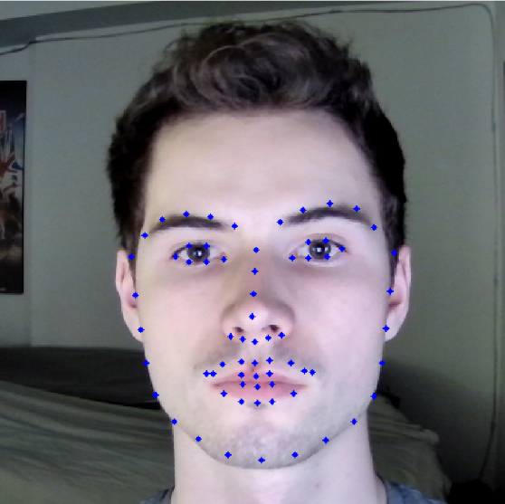

*Figure 5.3.2*: Dlib facial landmarks mapped on a webcam frame output
[[virtual-keyboard]]
=== Virtual Keyboard

The virtual keyboard is a vital component of this project, allowing the
user to interact with nearly every aspect of the computer system from
browsing the internet to sending emails, a keyboard needed to be
developed that would allow the user to perform these tasks seamlessly.

As mentioned previously, Haar cascade and blob detection were what our
team’s initial method of gaze tracking were developed around. This
method of tracking did not perform as well as we had initially hoped,
causing us to refine our strategy for user inputs. The idea of being
able to click each individual button on a keyboard seemed like it would
lead to a less than ideal user experience, so we opted to create a
custom keyboard that could be controlled by the user looking left,
right, up or down, moving a selector from button to button on the
keyboard in the direction of the users gaze. This would behave similarly
to a joystick in a sense, and can be seen highlighted in blue in figure
5.3.1. This keyboard was fully developed and functional, providing a
good user experience even with sub-optimal tracking capabilities.

Later in the project lifecycle we switched from using Haar cascade and
blob detection to using Dlib facial landmarks, which provided much more
accurate gaze tracking, and enabled us to utilize the built in windows
virtual keyboard. This keyboard was chosen over the custom design
because of its universal support across the entire computer system, as
well as it not needing to be threaded in our program alongside the main
tracking algorithm.

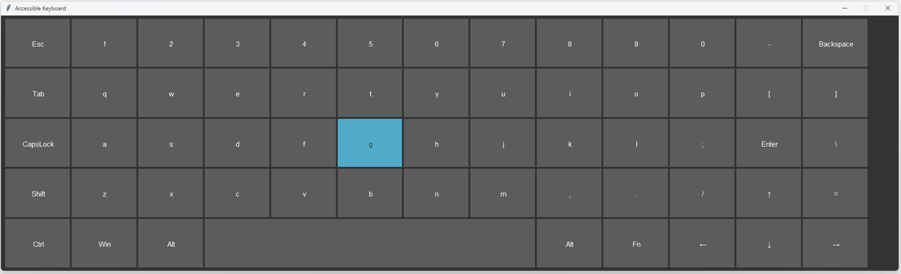

*Figure 5.3.1*: Custom Virtual Keyboard Design
[[materialcomponent-list]]
== Material/Component list

All materials and components used in the project were owned by the
members of the project. Therefore, the unit cost for each component was
$0.00.

[width="99%",cols="27%,40%,33%",options="header",]
|===
|*Material/Component* |*Quantity* |*Unit Cost*
|Desktop/Laptop |1 |$0.00
|Webcam (Internal or External) |1 |$0.00
|Monitor (External or Built-in) |1 |$0.00
|Webcam Arm Mount |1 |$0.00
|External Light Source (optional) |1 |$0.00
|===

*Table 6.1*: Material and Cost

[[measurement-and-testing-procedures]]
== Measurement and Testing Procedures

This project was tested extensively during development, and lots of data
was examined to determine the performance of our implementation. Some of
these metrics include the variance from the users min/max gaze
positions, the accuracy of blink detection, the accuracy of mouth
open/close detection, among others. The program’s thresholds and
variables could then be adjusted to improve results.

Although taking measurements like this is crucial to tracking
advancements, it is somewhat abstract for this project. The reason for
this is the amount of variance between results from different users with
different facial structures, eye shape, environment lighting, angle of
image capture. There are many factors that can make gathering meaningful
data about the program's effectiveness challenging. Fortunately, success
can very easily be measured based on a test subject’s experience using
the program. How well the calibration, gaze direction tracking, blink
and mouth detection perform can be gathered by how easily the user can
utilize the system and how smooth they feel the experience is. If the
user is able to calibrate their system, and use the system to browse and
type on a keyboard, this can, for the most part, be considered a
success.
[[performance-measurement-results]]
==  Performance Measurement Results

We used a lower resolution grid for mouse movements in order to reduce
the computational cost of moving the mouse. The degree of movement along
the screen is defined by the maximum range of mouse movement, and the
duration of the mouse movement. The grid is defined by dividing the
screen into a fixed number of horizontal and vertical segments, and the
mouse position is moved to the center of the segment that corresponds to
the gaze position. This reduces the number of pixels that need to be
updated for each mouse movement, which in turn reduces the computational
cost. This allows for greater precision in controlling the mouse cursor
with gaze tracking. A lower resolution grid also reduces the amount of
jitter or noise in the cursor movements.

During calibration, the user is instructed to look at four circles as
they appear on the screen. The eye-tracking system records the gaze
point for each circle and uses these points to adjust the eye-tracking
algorithm. Once calibration is complete, the adjust_eye_tracking
function is used to adjust the eye-tracking algorithm based on the
recorded gaze points. A function calculates the average gaze point for
each eye across all calibration points and calculates the offset between
the expected gaze points and the actual gaze points for each eye. The
offsets are used to adjust the eye-tracking algorithm, resulting in
greater accuracy and performance.

We calculate the position of the gaze by using the positions of the left
and right eyes detected using facial landmarks. An offset is added to
adjust for the position of the eyes relative to the center of the
screen, and the average position of the left and right eyes is taken as
the final gaze position. Finally, the gaze position is converted from
the video feed to screen coordinates to calculate the mouse_x and
mouse_y positions.

The tracker implements a method for detecting when the user blinks or
opens their mouth. This method involves analyzing multiple frames in
succession and comparing them to prevent false positives. We use
counters for Mouth and Eyes to keep track of the number of frames in
which the user's eyes are closed or their mouth is open, respectively.
These counters continue to accumulate until they reach the predefined
threshold for consecutive frames. Once the threshold is reached, the
Tracker identifies the blink or mouth event. These thresholds were
chosen through trial and error in order to minimize false detections
while still accurately detecting blinks and mouth openings.
[[analysis-of-performance]]
== Analysis of Performance

This chapter discusses the performance analysis of the various
approaches to eye tracking and gaze detection used throughout the
development of this project. The main methods discussed are blob
detection with Haar cascades and Dlib facial landmarks. Dlib facial
landmarks and blob detection are both methods used for eye detection,
but Dlib facial landmarks are generally considered to be more accurate
and reliable.
[[quantitative-analysis]]
=== Quantitative Analysis

As mentioned in the Alternative Designs chapter, we were able to
accurately track the user’s eyes as they looked in different directions
using blob detection and Haar cascades. The proposed plan was to extract
the keypoint center coordinates of the detected blobs and calculate the
difference between the coordinates to determine which direction the user
was looking in. However, during testing it was observed that the
difference in coordinates was too small to accurately differentiate
between the different directions a user was looking in. The average
difference in the horizontal direction and vertical direction relative
to the center was 4 pixels and 1 pixel respectively. The results are
shown in Table 9.1.

In contrast, the Dlib calibration coordinates had a larger difference in
each direction. The average difference in the horizontal direction and
vertical direction relative to the center was 12 pixels and 10 pixels
respectively. The results are shown in Table 9.1.

[width="100%",cols="34%,39%,27%",options="header",]
|===
|*User Gaze Direction* |*Blob Detection and Haar Cascade Calibration
Coordinates (x, y)* a|
*Dlib Calibration Coordinates*

*(x, y)*

|*Top Left* |(20, 22) |(320, 200)

|*Top Right* |(29, 21) |(340, 204)

|*Bottom Right* |(28, 19) |(339, 214)

|*Bottom Left* |(19, 20) |(318, 210)
|===

*Table 9.1*: Calibration coordinates for blob detection and Haar cascade
method and Dlib method

In Table 9.2 and 9.3 the conditions of lighting were adjusted to test
the accuracy of the tracking. The reference point was the center of the
screen and the coordinates were collected from a user blinking to click
at a certain point.

[width="100%",cols="34%,33%,33%",options="header",]
|===
|*Actual Coordinates of Center of the Screen* |*Coordinates of the
Center of the Screen Clicked Under Poor Lighting* |*Coordinates of the
Center of the Screen Clicked Under Optimal Lighting*
|(960, 540) |(842, 613) |(960, 484)
|===

*Table 9.2*: Comparison Between Coordinates Clicked Under Poor and
Optimal Lighting

[width="100%",cols="38%,31%,31%",options="header",]
|===
| |*Poor Lighting* |*Optimal Lighting*
|*Pixels Away From Actual Point* |139px |56px
|*Accuracy* |93.55% |97.50%
|===

*Table 9.3*: Number of Pixels From Actual Point and Calculated Accuracy
[[qualitative-analysis]]
=== Qualitative Analysis

The Dlib approach proved to be better than the blob detection approach
in overall tracking due to several reasons. Dlib facial landmarks
provide more detailed and accurate information about the positions of
important facial features. This makes it easier to accurately estimate
the gaze direction and position. Also, Dlib uses a machine
learning-based approach, which can better handle variations in lighting,
and head pose. In contrast, blob detection relies on simpler image
processing techniques, which may not be able to handle these variations
as effectively. The facial landmarks were produced through extensive
testing and evaluated on large datasets of face and eye images, whereas
the data used for blob detection is mainly for shapes.

[[conclusions]]
== Conclusions

A software application was developed to assist physically disabled
people with computer use. Originally, our design was aiming to create an
accessibility menu that acts more like mouse options rather than
actions. The menu was supposed to give options such as right click,
click and drag, double click, etc. This was changed to an accessibility
menu that provided the users with shortcut options to open certain
programs or windows such as browser and file explorer. Additionally the
eye tracking was designed to utilize Haar cascades and blob detection,
but was switched to Dlib for performance gains. Major difficulties
encountered that haven't been solved yet are mouse jitter and dead zones
during gaze tracking. During use, the mouse occasionally jitters enough
that the user may have difficulty clicking certain parts on the screen.
Future work includes improving the tracking accuracy and adding more
functionality and customization to the accessibility GUI. This can
include more actions and customizable buttons, along with sub-menus.
[[references]]
== References

[arabic]
. {blank}
+
____
O. Déniz, G. Bueno, J. Salido, and F. D. la Torre, “Face recognition
using histograms of oriented gradients,” Pattern Recognition Letters,
20-Jan-2011. [Online]. Available:
https://www.sciencedirect.com/science/article/abs/pii/S0167865511000122[[.underline]#https://www.sciencedirect.com/science/article/abs/pii/S0167865511000122#].
____
. {blank}
+
____
Chen, Junkai et al. “Facial Expression Recognition Based on Facial
Components Detection and HOG Features.” (2014).
____
. {blank}
+
____
Dewi, Christine et al. “Adjusting eye aspect ratio for strong eye blink
detection based on facial landmarks.” PeerJ. Computer science vol. 8
e943. 18 Apr. 2022, doi:10.7717/peerj-cs.943
____
. {blank}
+
____
King, D. E. (2013). “Dlib for Python.” Dlib Python Library.
http://dlib.net/python/
____
. {blank}
+
____
Z. Xu, X. Baojie and W. Guoxin, "Canny edge detection based on OpenCV,"
2017 13th IEEE International Conference on Electronic Measurement &
Instruments (ICEMI), 2017, pp. 53-56, doi: 10.1109/ICEMI.2017.8265710.
____
. {blank}
+
____
Mantoro, Teddy, et al. Multi-Faces Recognition Process Using Haar
Cascades and Eigenface Methods. IEEE, 2018, pp. 1–5.
____
